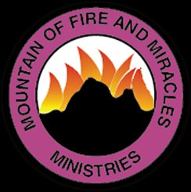

# MFM Mega Region 2 USA — Official Mobile App

<p align="center">
  
</p>

<p align="center">
  <strong>Mountain of Fire and Miracles Ministries</strong><br/>
  <em>"A do-it-yourself Gospel ministry where your hands are trained to wage war and your fingers to do battle"</em> — Psalm 144:1
</p>

<p align="center">
  
  
  
  
</p>

---

## About

A React Native (Expo) mobile app for **MFM Mega Region 2 USA**, serving 16+ branches across **Texas and Florida**. Built for Google Play Store and Apple App Store.

**2026 Declaration**: *"My Year of Great Deliverance and Fresh Glory"* — Genesis 45:7

### Why This Exists

Churches spend $2,000–$25,000+ on streaming equipment, management tools, and apps. Most can't afford it. This app is part of the **Ministry Stream Platform** — a free, non-profit tech solution for churches worldwide.

---

## Features

| Feature | Description |
|---------|-------------|
| **Livestream** | YouTube integration — Mega Region 2 + HQ channels |
| **Daily Devotionals** | MFM-style prayer points with Bible readings |
| **Anonymous Prayer Wall** | Fully anonymous — no accounts, no names, no tracking |
| **Branch Directory** | 16+ branches with address, phone, email, Google Maps |
| **Events & Services** | Weekly schedule, PMCH tracking, special events |
| **Announcements** | Priority-tagged updates from leadership |
| **Profile & Settings** | Branch selection, notification preferences |

---

## Quick Start

### Prerequisites

- **Node.js 18+** — [nodejs.org](https://nodejs.org/)
- **Expo Go** on your phone — [iOS](https://apps.apple.com/app/expo-go/id982107779) | [Android](https://play.google.com/store/apps/details?id=host.exp.exponent)

### Setup

```bash
# 1. Clone
git clone https://github.com/YOUR_USERNAME/mfm-mega-region2-app.git
cd mfm-mega-region2-app

# 2. Install
npm install

# 3. Run
npx expo start

# 4. Scan QR code with Expo Go on your phone
```

### Run on Simulator

```bash
npx expo start --ios      # Requires Xcode (Mac only)
npx expo start --android  # Requires Android Studio
```

---

## Building for App Stores

### Prerequisites

1. **Expo account** — [expo.dev/signup](https://expo.dev/signup)
2. **EAS CLI** — `npm install -g eas-cli`
3. **Google Play** developer ($25) — [play.google.com/console](https://play.google.com/console)
4. **Apple Developer** ($99/yr) — [developer.apple.com](https://developer.apple.com/programs/)

### Build & Submit

```bash
# Login
npx eas login

# Configure
npx eas build:configure

# Android (AAB for Google Play)
npx eas build --platform android --profile production

# iOS (IPA for App Store)
npx eas build --platform ios --profile production

# Submit
npx eas submit --platform android
npx eas submit --platform ios
```

---

## Project Structure

```
├── App.js                          # Entry point
├── app.json                        # Expo config
├── eas.json                        # EAS Build config
├── assets/
│   └── mfm-logo.png               # Official MFM logo
└── src/
    ├── navigation/AppNavigator.js  # Tab + Stack navigation
    ├── screens/
    │   ├── HomeScreen.js           # Dashboard with MFM logo
    │   ├── LivestreamScreen.js     # YouTube channels + schedule
    │   ├── PrayerRequestsScreen.js # Anonymous prayer wall
    │   ├── DirectoryScreen.js      # Branches (location + email)
    │   ├── EventsScreen.js         # Weekly + special events
    │   ├── DevotionalsScreen.js    # Devotional listing
    │   ├── DevotionalDetailScreen.js
    │   ├── EventDetailScreen.js
    │   ├── AnnouncementsScreen.js
    │   └── ProfileScreen.js
    ├── components/                 # Card, Header, Badge
    ├── theme/                      # Colors, Typography
    └── data/mockData.js            # All app data
```

---

## Roadmap

- [x] V1.0 — Core app (Livestream, Prayer, Directory, Events, Devotionals)
- [ ] V1.1 — Firebase admin panel for content management
- [ ] V1.2 — Online giving, sermon archives, MFM Hymnal
- [ ] V1.3 — 70 Days Fasting tracker, Bible reading, testimonies
- [ ] V2.0 — Ministry Stream Platform integration

---

## Contributing

1. Fork this repo
2. Create a branch: `git checkout -b feature/your-feature`
3. Commit: `git commit -m 'Add your feature'`
4. Push: `git push origin feature/your-feature`
5. Open a Pull Request

See [CONTRIBUTING.md](CONTRIBUTING.md) for details.

---

## About MFM

**Mountain of Fire and Miracles Ministries** — Founded 1989 by Dr. D.K. Olukoya. Operating in 120+ countries.

- **YouTube**: [@mfmmegaregion2usa](https://www.youtube.com/@mfmmegaregion2usa)
- **Facebook**: [MFM Mega Region 2 USA](https://www.facebook.com/p/MFM-Mega-Region-2-USA-61556716678081/)
- **Phone**: (346) 414-5880

## License

MIT License — see [LICENSE](LICENSE)

---

<p align="center"><em>Built for the glory of God through MFM Mega Region 2 USA</em></p>
